# Домашнее задание к занятию 4 «Оркестрация группой Docker контейнеров на примере Docker Compose»

**Выполнил:** Шаров Олег  
 
**Репозиторий:** [Myth3916/docker-task1](https://github.com/Myth3916/docker-task1)

---

## 🔗 Ссылки

| Ресурс | Ссылка |
|--------|--------|
| Репозиторий на GitHub | [Myth3916/docker-task1](https://github.com/Myth3916/docker-task1) |
| Docker Hub репозиторий | [myth3916/custom-nginx](https://hub.docker.com/r/myth3916/custom-nginx) |

---

## ✅ Задача 1: Сборка и отправка образа custom-nginx

### 🔹 Шаги выполнения:

1. **Установка Docker на Arch Linux:**
   ```bash
   sudo pacman -S docker docker-compose-plugin
   sudo systemctl enable --now docker
   sudo usermod -aG docker $USER
   ```

2. **Создан Dockerfile:**
   ```dockerfile
   FROM nginx:1.29.0
   COPY index.html /usr/share/nginx/html/index.html
   RUN chmod 644 /usr/share/nginx/html/index.html
   ```

3. **Сборка образа:**
   ```bash
   docker build -t myth3916/custom-nginx:1.0.0 .
   ```

4. **Отправка в Docker Hub:**
   ```bash
   docker login
   docker push myth3916/custom-nginx:1.0.0
   ```

### 🔹 Скриншот:

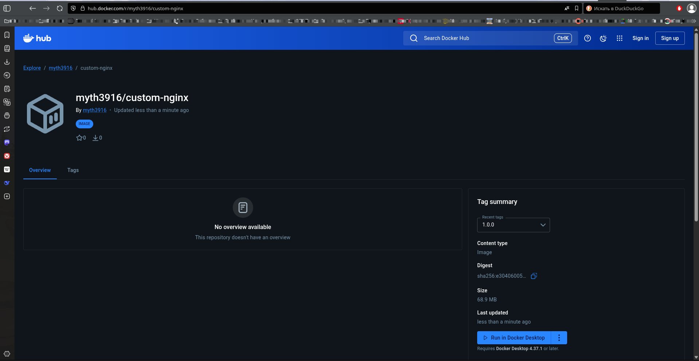
*Рисунок 1: Образ custom-nginx:1.0.0 в Docker Hub*

---

## ✅ Задача 2: Запуск и проверка контейнера

### 🔹 Команды:

**Запуск контейнера:**
```bash
docker run -d \
  --name Oleg-custom-nginx-t2 \
  -p 127.0.0.1:8080:80 \
  myth3916/custom-nginx:1.0.0
```

**Переименование:**
```bash
docker rename Oleg-custom-nginx-t2 custom-nginx-t2
```

**Исправление прав доступа (403 Forbidden):**
```bash
docker exec -u root custom-nginx-t2 chmod 644 /usr/share/nginx/html/index.html
```

**Проверка доступности:**
```bash
curl http://127.0.0.1:8080
```

### 🔹 Скриншоты:

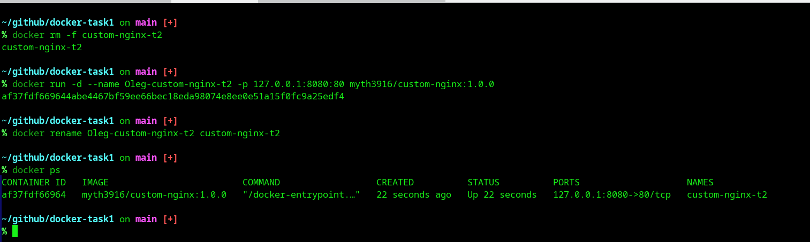
*Рисунок 2: Запуск контейнера и переименование*

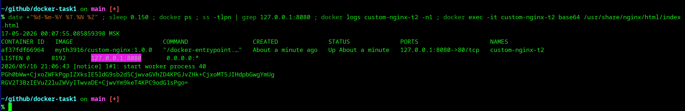
*Рисунок 3: Вывод команды date, docker ps, ss, logs, base64*

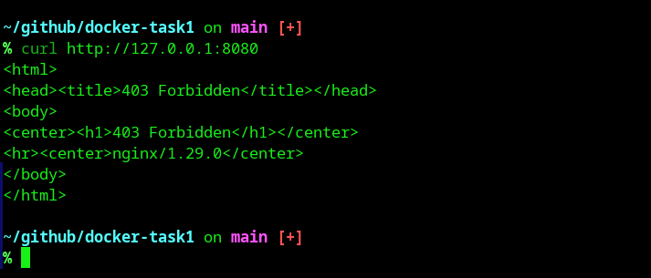
*Рисунок 4: Проверка доступности страницы через curl*

---

## ✅ Задача 3: Работа с потоками и конфигурацией

### 🔹 3.1. Подключение к стандартному потоку контейнера

**Команды:**
```bash
docker attach custom-nginx-t2
# Нажатие Ctrl-C
docker ps -a
docker start custom-nginx-t2
```

**Почему контейнер остановился после Ctrl-C?**

> При использовании `docker attach` мы подключаемся к основному процессу контейнера (nginx). 
> Нажатие `Ctrl-C` отправляет сигнал `SIGINT` (сигнал прерывания, код 2), который nginx 
> обрабатывает как команду на завершение работы. Nginx корректно завершает все worker-процессы 
> и останавливается, что приводит к остановке контейнера.

### 🔹 Скриншоты:

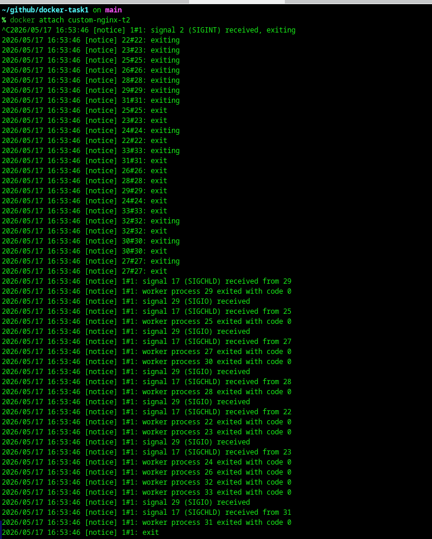

*Рисунок 5: Подключение к контейнеру и остановка через Ctrl-C*

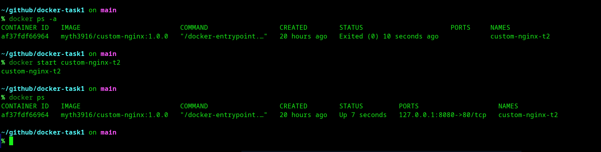
*Рисунок 6: Перезапуск контейнера командой docker start*

---


### 🔹 3.2. Вход в контейнер и изменение конфигурации

**Команды:**
```bash
docker exec -it custom-nginx-t2 bash
apt-get update
apt-get install -y nano
nano /etc/nginx/conf.d/default.conf
# Изменено: listen 80 → listen 81
nginx -s reload
curl http://127.0.0.1:80   # Ошибка подключения
curl http://127.0.0.1:81   # Успешный ответ (403 Forbidden из-за прав)
exit
```

---

### 🔹 3.3. Проблема с портами

**Проверка на хостовой машине:**
```bash
ss -tlpn | grep 127.0.0.1:8080
docker port custom-nginx-t2
curl http://127.0.0.1:8080
```

**Суть возникшей проблемы:**

> При запуске контейнера был настроен проброс портов: `-p 127.0.0.1:8080:80`. 
> Это означает: "всё, что приходит на порт хоста 8080, перенаправлять на порт контейнера 80".
> 
> После изменения конфигурации nginx внутри контейнера на `listen 81`, он перестал слушать 
> порт 80. Docker продолжает пересылать трафик на порт 80, но там никто не слушает. 
> В результате соединение сбрасывается с ошибкой "Recv failure: Соединение разорвано 
> другой стороной".

### 🔹 Скриншот (команды 3.2 и 3.3):

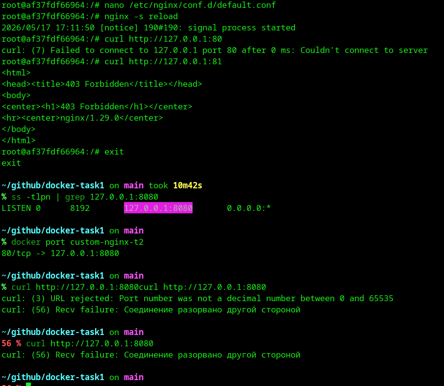
*Рисунок 7: Перезагрузка nginx, проверка портов 80/81 и демонстрация проблемы*
```

---

### 🔹 3.4. Удаление работающего контейнера

**Команда:**
```bash
docker rm -f custom-nginx-t2
```

**Объяснение:** Флаг `-f` (force) принудительно останавливает работающий контейнер 
(отправляет SIGKILL) и затем удаляет его.

### 🔹 Скриншот:

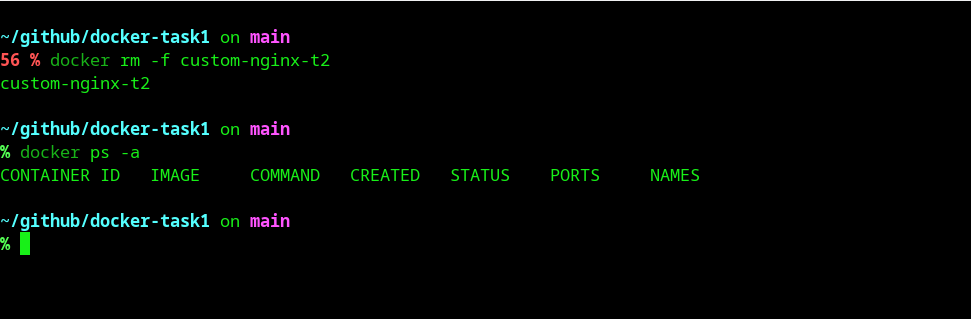
*Рисунок 9: Принудительное удаление контейнера*

---

## ✅ Задача 4: Общие тома (Volume) между контейнерами

### 🔹 Шаги выполнения:

1. **Запуск CentOS контейнера:**
   ```bash
   docker run -d --name centos-vol -v $(pwd):/data centos:7 sleep 3600
   ```

2. **Запуск Debian контейнера:**
   ```bash
   docker run -d --name debian-vol -v $(pwd):/data debian:latest sleep 3600
   ```

3. **Создание файла в CentOS:**
   ```bash
   docker exec -it centos-vol bash -c "echo 'Hello from CentOS' > /data/from-centos.txt"
   ```

4. **Создание файла на хосте:**
   ```bash
   echo "Hello from Host" > from-host.txt
   ```

5. **Проверка в Debian:**
   ```bash
   docker exec -it debian-vol bash -c "ls -la /data && cat /data/from-centos.txt && cat /data/from-host.txt"
   ```

**Результат:** Оба файла (`from-centos.txt` и `from-host.txt`) видны в контейнере Debian, 
что подтверждает работу общих томов.

### 🔹 Скриншот:

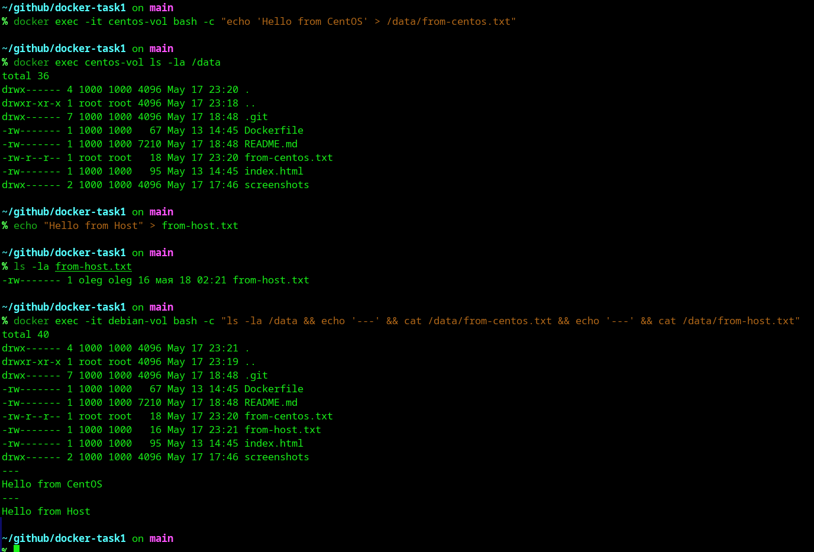
*Рисунок 9: Демонстрация общих томов между контейнерами*

---

## ✅ Задача 5: Docker Compose и Portainer

### 🔹 5.1. Приоритет файлов Docker Compose

**Вопрос:** Какой из файлов был запущен и почему?

**Ответ:** Запустился файл `compose.yaml`, так как Docker Compose следует приоритету файлов:
1. `compose.yaml` (наивысший приоритет) ✅
2. `compose.yml`
3. `docker-compose.yaml`
4. `docker-compose.yml`

При наличии нескольких файлов используется первый по приоритету.

### 🔹 5.2. Запуск обоих сервисов

Для запуска обоих сервисов (portainer и registry) добавлена директива `include`:

```yaml
# compose.yaml
services:
  portainer:
    network_mode: host
    image: portainer/portainer-ce:latest
    volumes:
      - /var/run/docker.sock:/var/run/docker.sock

include:
  - docker-compose.yaml
```

### 🔹 5.3. Загрузка образа в локальный Registry

**Настройка insecure-registry:**

```bash
# Создание /etc/docker/daemon.json
{
  "registry-mirrors": ["https://mirror.gcr.io"],
  "insecure-registries": ["127.0.0.1:5000"]
}

# Перезапуск Docker
sudo systemctl restart docker
```

**Тегирование и загрузка:**
```bash
docker tag myth3916/custom-nginx:1.0.0 127.0.0.1:5000/custom-nginx:latest
docker push 127.0.0.1:5000/custom-nginx:latest
```

### 🔹 5.4. Развёртывание стека в Portainer

1. Открыт Portainer: `http://127.0.0.1:9000`
2. Создан пользователь admin
3. Выбрано локальное окружение
4. Через **Stacks → Add stack → Web editor** задеплоен стек:

```yaml
version: '3'
services:
  nginx:
    image: 127.0.0.1:5000/custom-nginx
    ports:
      - "9090:80"
```

### 🔹 Скриншоты:

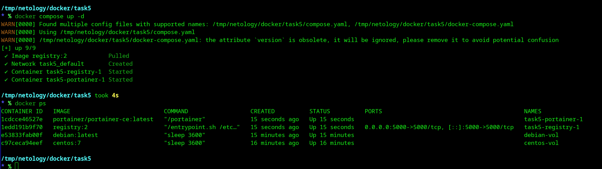
*Рисунок 10: Запуск portainer и registry через docker compose*

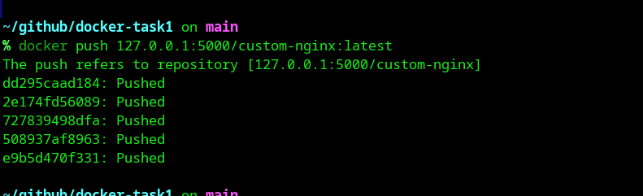
*Рисунок 11: Загрузка образа в локальный registry*

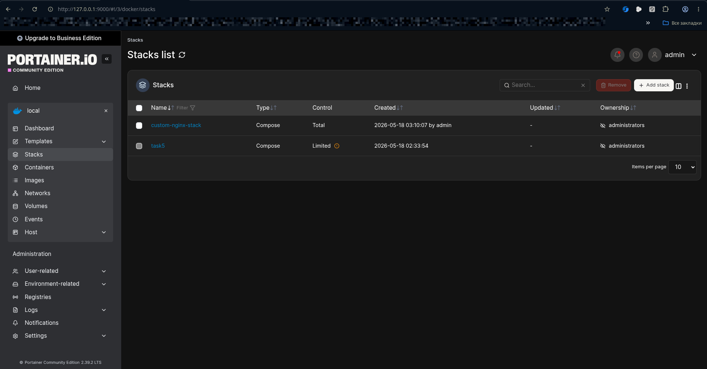
*Рисунок 12: Стек custom-nginx-stack в Portainer*

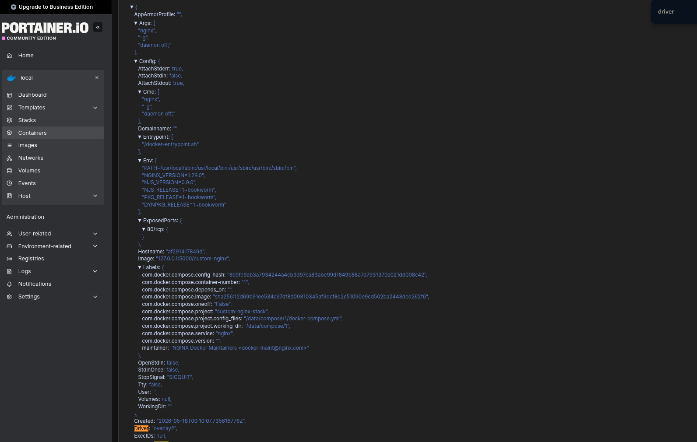
*Рисунок 13: Inspect контейнера (Config секция)*

---

### 🔹 5.5. Удаление манифеста и warning

**Удаление файла:**
```bash
rm compose.yaml
docker compose up -d
```

**Warning:**
```
WARN[0000] Found orphan containers ([task5-portainer-1]) for this project. 
If you removed or renamed this service in your compose file, you can run 
this command with the --remove-orphans flag to clean it up.
```

**Объяснение:** Docker Compose обнаружил контейнер `task5-portainer-1`, 
который был запущен ранее, но больше не описан в конфигурационных файлах. 
Такие контейнеры называются **orphan** («сироты»).

**Очистка:**
```bash
docker compose up -d --remove-orphans
docker compose down
```

### 🔹 Скриншот:

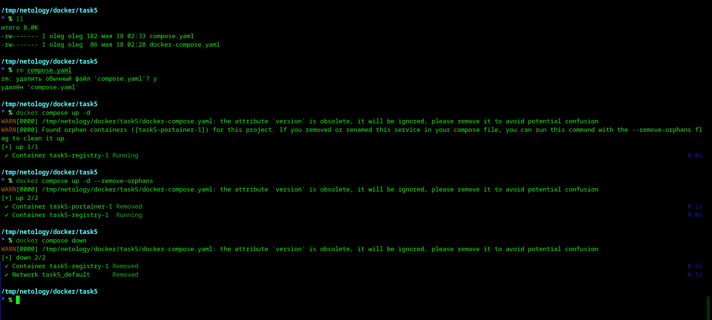
*Рисунок 14: Warning про orphan containers и очистка проекта*

---

## 🛠️ Полезные команды

```bash
# Проверить образы
docker images

# Проверить контейнеры
docker ps -a

# Просмотр логов
docker logs <container_name>

# Вход в контейнер
docker exec -it <container_name> bash

# Подключение к потоку
docker attach <container_name>

# Очистка
docker system prune -a
```

---

> 💡 **Примечание:** Все скриншоты сохранены в папке `./screenshots/`
```
